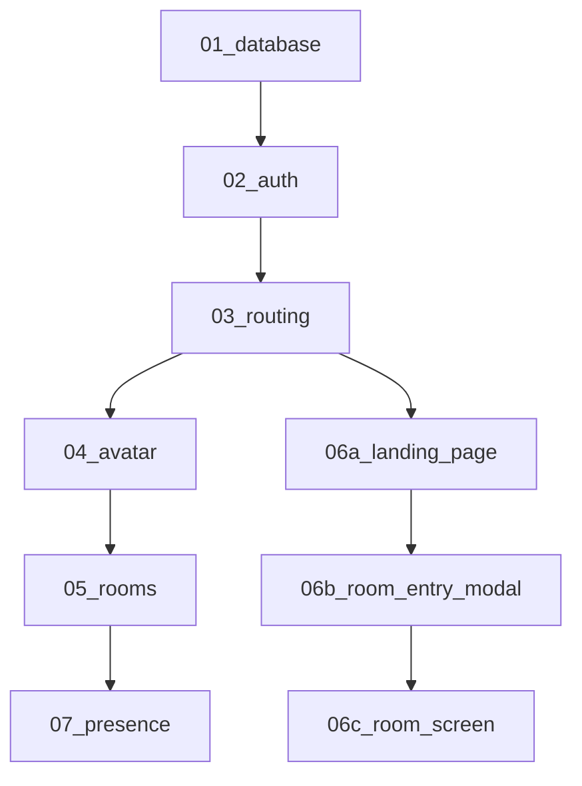

# Supabase Gather - ドキュメント構成

## 📋 タスク実行順序（Claude最適化済み）

以下の順序でタスクを実行すると、**依存関係に沿った効率的な開発**が可能です：

### 1️⃣ [01_database.md](01_database.md) - データベース設計
**基盤**: すべての機能の前提となるデータ構造
- テーブル定義・スキーマ
- RLS設定・セキュリティ
- インデックス設計・マイグレーション

### 2️⃣ [02_auth.md](02_auth.md) - 認証システム
**基礎機能**: アプリケーションの認証・認可基盤
- DDD/Clean Architecture構造
- Google OAuth実装
- ゲスト認証フロー
- セッション・認証ガード

### 3️⃣ [03_routing.md](03_routing.md) - ルーティング基盤
**インフラ**: アプリケーション全体のナビゲーション
- 保護ルート・ミドルウェア
- 動的ルーティング
- リダイレクト処理

### 4️⃣ [04_avatar.md](04_avatar.md) - アバターシステム  
**基本機能**: ユーザーの視覚的表現
- アバター選択・表示UI
- アセット管理
- 永続化・同期ロジック

### 5️⃣ [05_rooms.md](05_rooms.md) - ルーム機能
**統合機能**: 全機能を統合したメインフィーチャー
- Realtime Presence統合
- 2Dスペース・チャット
- 接続制限・ルーム管理

### 6️⃣ ユーザーフロー（画面別実装）
**UXフロー**: エンドツーエンドのユーザー体験（画面ごとに分割）

#### 6a️⃣ [06a_landing_page.md](06a_landing_page.md) - ランディングページ
- アプリエントリーポイント
- Google/ゲスト認証オプション
- 認証後のモーダル表示制御

#### 6b️⃣ [06b_room_entry_modal.md](06b_room_entry_modal.md) - 入室準備モーダル
- 表示名・アバター設定UI
- ルーム状態監視・入室制御
- エラーハンドリング

#### 6c️⃣ [06c_room_screen.md](06c_room_screen.md) - ルーム画面
- 2Dスペース・アバター移動
- リアルタイムチャット
- 設定変更・退室機能

### 7️⃣ [07_presence.md](07_presence.md) - リアルタイム機能
**高度機能**: リアルタイム同期・通信
- Presence管理
- 同時接続制限
- パフォーマンス最適化

## 🔄 依存関係の説明

### なぜこの順序なのか

**✅ Claude Code最適化のポイント:**

1. **データベース先行**: 全機能の前提となるスキーマ・RLS設計
2. **認証基盤**: DDD/Clean Architecture + 実装パターン確立
3. **ルーティング基盤**: 保護ルート・ナビゲーション基盤構築
4. **アバター機能**: 軽量機能での実装パターン確認
5. **ルーム統合**: 全機能統合による複雑機能実装
6. **UI段階実装**: 機能準備完了後の画面実装
7. **高度機能**: リアルタイム・パフォーマンス最適化

**✅ 実装効率化のポイント:**
- **段階的複雑度増加**: 簡単→複雑な機能順序
- **依存関係の明確化**: 前提条件の事前実装
- **実装パターンの確立**: 認証→アバターで確立、ルームで応用

**✨ 画面分割のメリット:**
- **フォーカスの向上**: 各画面の実装に集中できる
- **コードの品質向上**: 単一責任での実装
- **テスト容易性**: 画面単位での動作確認
- **並行開発**: 複数画面の同時開発が可能

## 📁 その他のドキュメント

- [requirements.md](requirements.md) - 総合要件定義書
- [auth-setup-guide.md](auth-setup-guide.md) - 認証設定ガイド

## 🎯 実装のコツ

1. **段階的実装**: 各ドキュメントの順序通りに実装
2. **依存関係の確認**: 前の機能が完了してから次へ
3. **テスト**: 各段階での動作確認
4. **ドキュメント更新**: 実装中の発見事項を反映

この順序に従うことで、**効率的で一貫性のある開発**が可能になります。