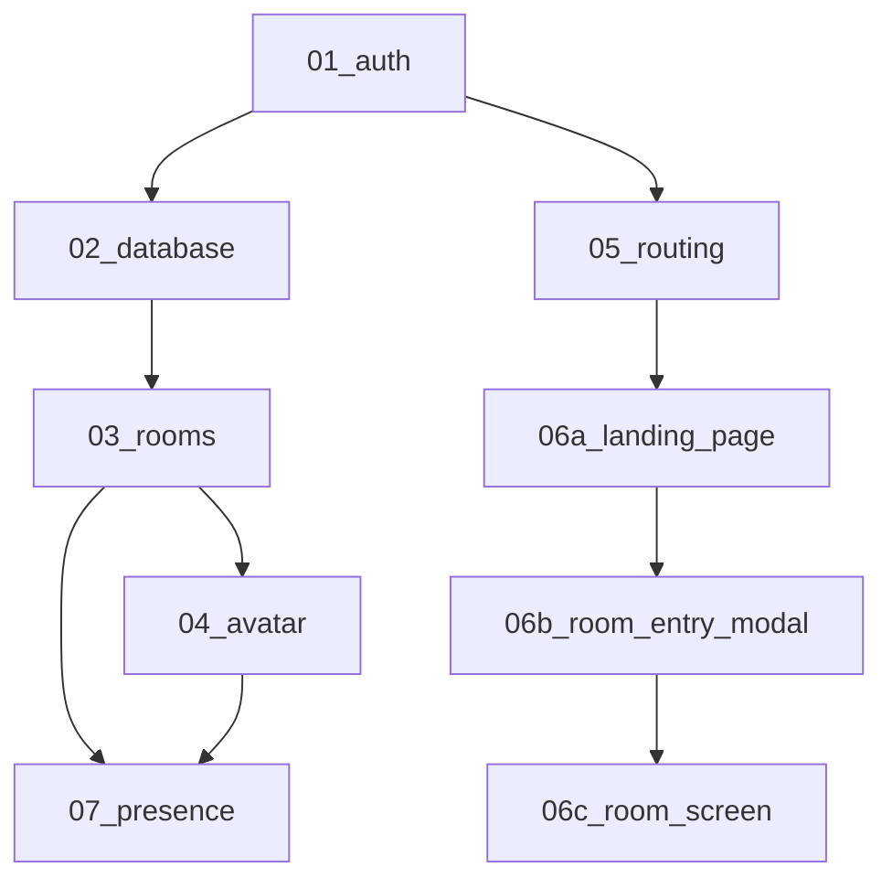

# Supabase Gather - ドキュメント構成

## 📋 タスク実行順序（Claude最適化済み）

以下の順序でタスクを実行すると、**依存関係に沿った効率的な開発**が可能です：

### 1️⃣ [01_auth.md](01_auth.md) - 認証システム
**基盤**: すべての機能の前提となる認証システム
- Googleログイン
- ゲストログイン  
- セッション管理
- セキュリティ設計

### 2️⃣ [02_database.md](02_database.md) - データベース設計
**土台**: 全機能で使用するデータベース構造
- テーブル定義
- RLS設定
- インデックス設計
- 移行・拡張性

### 3️⃣ [03_rooms.md](03_rooms.md) - ルーム機能
**コア機能**: バーチャルオフィスの基本単位
- ルーム管理
- 同時接続制限
- 将来拡張性

### 4️⃣ [04_avatar.md](04_avatar.md) - アバターシステム  
**視覚要素**: ユーザーの視覚的表現
- アバター仕様
- データ管理
- UI/UX設計

### 5️⃣ [05_routing.md](05_routing.md) - ルーティング仕様
**ナビゲーション**: アプリケーション全体のURL構造
- 画面構成
- ナビゲーションフロー  
- 認証ガード

### 6️⃣ ユーザーフロー（画面別実装）
**UXフロー**: エンドツーエンドのユーザー体験（画面ごとに分割）

#### 6a️⃣ [06a_landing_page.md](06a_landing_page.md) - ランディングページ
- アプリエントリーポイント
- Google/ゲスト認証オプション
- 認証後のモーダル表示制御

#### 6b️⃣ [06b_room_entry_modal.md](06b_room_entry_modal.md) - 入室準備モーダル
- 表示名・アバター設定UI
- ルーム状態監視・入室制御
- エラーハンドリング

#### 6c️⃣ [06c_room_screen.md](06c_room_screen.md) - ルーム画面
- 2Dスペース・アバター移動
- リアルタイムチャット
- 設定変更・退室機能

### 7️⃣ [07_presence.md](07_presence.md) - リアルタイム機能
**高度機能**: リアルタイム同期・通信
- Presence管理
- 同時接続制限
- パフォーマンス最適化

## 🔄 依存関係の説明

### なぜこの順序なのか

**✅ 最適化のポイント:**

1. **認証 → データベース**: 認証前提でのRLS設計
2. **データベース → 機能**: テーブル構造理解後の機能実装
3. **ルーム → アバター**: ルームでのアバター利用設計  
4. **ルーティング → 画面実装**: URL構造理解後の画面実装
5. **画面単位の段階実装**: ランディング → モーダル → ルーム画面
6. **基本機能 → リアルタイム**: 基盤完成後の高度機能実装

**❌ 旧順序の問題点:**
- データベース設計が後回し（他機能への影響）
- ルーティングが最後（フロー設計への影響）
- 画面が1つのファイルにまとまっている（実装時の焦点不足）
- 依存関係の逆転による実装の混乱

**✨ 画面分割のメリット:**
- **フォーカスの向上**: 各画面の実装に集中できる
- **コードの品質向上**: 単一責任での実装
- **テスト容易性**: 画面単位での動作確認
- **並行開発**: 複数画面の同時開発が可能

## 📁 その他のドキュメント

- [requirements.md](requirements.md) - 総合要件定義書
- [auth-setup-guide.md](auth-setup-guide.md) - 認証設定ガイド

## 🎯 実装のコツ

1. **段階的実装**: 各ドキュメントの順序通りに実装
2. **依存関係の確認**: 前の機能が完了してから次へ
3. **テスト**: 各段階での動作確認
4. **ドキュメント更新**: 実装中の発見事項を反映

この順序に従うことで、**効率的で一貫性のある開発**が可能になります。